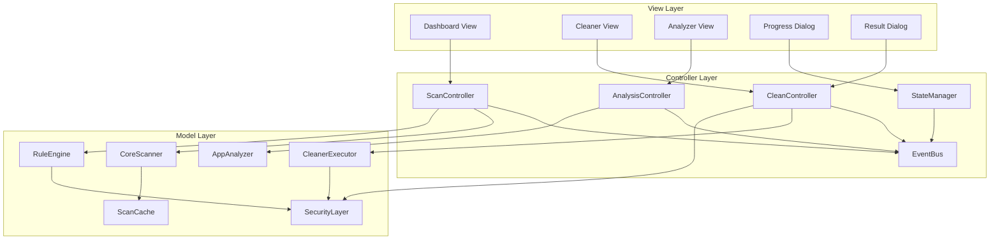
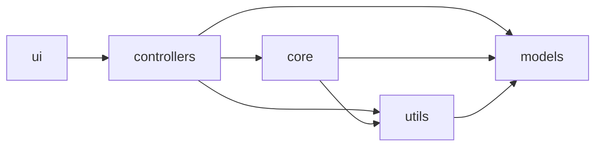

# C-Wiper：Windows 轻量化清理与分析工具详细设计文档

**版本：** v1.1 (Detailed Design)
**日期：** 2026-01-31
**文档状态：** 待评审
**对应概要设计：** V1.1

---

## 文档修订历史

| 版本 | 日期 | 修订内容 | 作者 |
|------|------|---------|------|
| v1.1 | 2026-01-31 | 初始详细设计版本 | - |

---

## 目录

- [第1章：概述](#第1章概述)
- [第2章：系统架构详细设计](#第2章系统架构详细设计)
- [第3章：核心模块详细设计](#第3章核心模块详细设计)
- [第4章：数据结构设计](#第4章数据结构设计)
- [第5章：接口设计](#第5章接口设计)
- [第6章：算法详细设计](#第6章算法详细设计)
- [第7章：UI/UX详细设计](#第7章uiux详细设计)
- [第8章：安全设计详细](#第8章安全设计详细)
- [第9章：性能优化方案](#第9章性能优化方案)
- [第10章：错误处理与日志](#第10章错误处理与日志)
- [第11章：测试设计](#第11章测试设计)
- [附录A：配置文件规范](#附录a配置文件规范)
- [附录B：错误码定义](#附录b错误码定义)

---

## 第1章：概述

### 1.1 文档目的

本详细设计文档基于《C-Wiper 概要设计文档 V1.1》，为开发团队提供实施级别的技术规范。文档包含：

- 每个模块的详细类设计和接口定义
- 核心算法的实现细节
- 数据结构规范
- 线程同步机制
- 错误处理策略

**目标读者**：开发工程师、测试工程师、技术评审人员

### 1.2 系统目标

| 目标 | 指标 | 说明 |
|------|------|------|
| 轻量化 | 单文件 < 30MB | 使用 Nuitka 编译 |
| 性能 | 扫描 10 万文件 < 60 秒 | Windows API 优化 |
| 安全 | 多层防护 + TOCTOU 防护 | 硬编码 + 动态检查 |
| 可用性 | 启动时间 < 3 秒 | 5 年旧电脑标准 |

### 1.3 参考文档

1. 《C-Wiper 概要设计文档 V1.1》
2. [PEP 8 -- Style Guide for Python Code](https://www.python.org/dev/peps/pep-0008/)
3. [Python threading 文档](https://docs.python.org/3/library/threading.html)
4. [Windows API 文档](https://docs.microsoft.com/en-us/windows/win32/api/)

### 1.4 术语定义

| 术语 | 定义 |
|------|------|
| **靶点扫描** | 针对预设的高频垃圾路径进行精准扫描，而非全盘遍历 |
| **TOCTOU** | Time-of-Check-Time-of-Use，检查与使用之间的时间差攻击 |
| **孤儿数据** | 应用已卸载，但 AppData 中仍残留的用户数据 |
| **应用簇** | Static Zone 的程序目录 + Dynamic Zone 的数据目录的组合 |

---

## 第2章：系统架构详细设计

### 2.1 整体架构图



### 2.2 目录结构设计

```
cwiper/
├── main.py                      # 程序入口
├── config/
│   ├── __init__.py
│   ├── settings.py              # 配置管理
│   └── rules.json               # 规则库
├── core/
│   ├── __init__.py
│   ├── scanner.py               # 核心扫描模块
│   ├── rule_engine.py           # 规则引擎
│   ├── app_analyzer.py          # 应用分析器
│   ├── cleaner.py               # 清理执行器
│   └── security.py              # 安全模块
├── controllers/
│   ├── __init__.py
│   ├── scan_controller.py       # 扫描控制器
│   ├── clean_controller.py      # 清理控制器
│   └── state_manager.py         # 状态管理器
├── ui/
│   ├── __init__.py
│   ├── main_window.py           # 主窗口
│   ├── dashboard.py             # 仪表盘
│   ├── cleaner_view.py          # 清理视图
│   ├── analyzer_view.py         # 分析视图
│   └── dialogs.py               # 对话框
├── utils/
│   ├── __init__.py
│   ├── event_bus.py             # 事件总线
│   ├── thread_queue.py          # 线程安全队列
│   ├── file_utils.py            # 文件工具
│   └── winapi.py                # Windows API 封装
├── models/
│   ├── __init__.py
│   ├── scan_result.py           # 扫描结果模型
│   ├── app_cluster.py           # 应用簇模型
│   └── clean_report.py          # 清理报告模型
└── tests/
    ├── __init__.py
    ├── test_scanner.py
    ├── test_rule_engine.py
    └── test_app_analyzer.py
```

### 2.3 模块依赖关系



**依赖规则**：
- UI 层依赖 Controller 层
- Controller 层依赖 Core、Utils、Models
- Core 层不依赖 UI 和 Controller
- Models 层独立，不依赖其他业务模块

### 2.4 事件驱动架构

#### 2.4.1 事件定义

```python
from enum import Enum
from dataclasses import dataclass
from typing import Any, Callable, Dict, List

class EventType(Enum):
    """事件类型枚举"""
    # 扫描事件
    SCAN_STARTED = "scan_started"
    SCAN_PROGRESS = "scan_progress"
    SCAN_COMPLETED = "scan_completed"
    SCAN_FAILED = "scan_failed"
    SCAN_CANCELLED = "scan_cancelled"

    # 清理事件
    CLEAN_STARTED = "clean_started"
    CLEAN_PROGRESS = "clean_progress"
    CLEAN_COMPLETED = "clean_completed"
    CLEAN_FAILED = "clean_failed"

    # 错误事件
    ERROR_OCCURRED = "error_occurred"

@dataclass
class Event:
    """事件对象"""
    type: EventType
    data: Dict[str, Any]
    timestamp: float

    def __post_init__(self):
        if self.timestamp == 0:
            import time
            self.timestamp = time.time()
```

#### 2.4.2 事件总线实现

```python
import threading
from typing import Dict, List, Callable

class EventBus:
    """线程安全的事件总线"""

    _instance = None
    _lock = threading.Lock()

    def __new__(cls):
        if cls._instance is None:
            with cls._lock:
                if cls._instance is None:
                    cls._instance = super().__new__(cls)
                    cls._instance._subscribers: Dict[EventType, List[Callable]] = {}
                    cls._instance._event_lock = threading.Lock()
        return cls._instance

    def subscribe(self, event_type: EventType, callback: Callable[[Event], None]):
        """订阅事件"""
        with self._event_lock:
            if event_type not in self._subscribers:
                self._subscribers[event_type] = []
            self._subscribers[event_type].append(callback)

    def unsubscribe(self, event_type: EventType, callback: Callable[[Event], None]):
        """取消订阅"""
        with self._event_lock:
            if event_type in self._subscribers:
                self._subscribers[event_type].remove(callback)

    def publish(self, event: Event):
        """发布事件（异步通知所有订阅者）"""
        with self._event_lock:
            subscribers = self._subscribers.get(event.type, [])

        # 在锁外执行回调，避免死锁
        for callback in subscribers:
            try:
                callback(event)
            except Exception as e:
                # 记录错误但不中断其他订阅者
                import logging
                logging.error(f"Event callback error: {e}")

    def clear(self):
        """清空所有订阅（主要用于测试）"""
        with self._event_lock:
            self._subscribers.clear()
```

### 2.5 线程安全的状态管理

```python
import threading
import queue
from enum import Enum
from typing import Optional

class SystemState(Enum):
    """系统状态枚举"""
    IDLE = "idle"
    SCANNING = "scanning"
    CLEANING = "cleaning"
    ANALYZING = "analyzing"

class StateManager:
    """线程安全的状态管理器"""

    _instance = None
    _lock = threading.Lock()

    def __new__(cls):
        if cls._instance is None:
            with cls._lock:
                if cls._instance is None:
                    cls._instance = super().__new__(cls)
                    cls._instance._state = SystemState.IDLE
                    cls._instance._lock = threading.RLock()
                    cls._instance._cancel_flag = False
                    cls._instance._result_queue = queue.Queue()
        return cls._instance

    @property
    def state(self) -> SystemState:
        """获取当前状态"""
        with self._lock:
            return self._state

    def transition_to(self, new_state: SystemState) -> bool:
        """状态转换"""
        with self._lock:
            # 定义合法的状态转换
            valid_transitions = {
                SystemState.IDLE: [SystemState.SCANNING, SystemState.ANALYZING],
                SystemState.SCANNING: [SystemState.IDLE, SystemState.CLEANING],
                SystemState.ANALYZING: [SystemState.IDLE],
                SystemState.CLEANING: [SystemState.IDLE],
            }

            if new_state not in valid_transitions.get(self._state, []):
                raise RuntimeError(
                    f"Invalid state transition: {self._state} -> {new_state}"
                )

            self._state = new_state
            self._cancel_flag = False
            return True

    def can_start_scan(self) -> bool:
        """检查是否可以开始扫描"""
        return self._state == SystemState.IDLE

    def can_start_clean(self) -> bool:
        """检查是否可以开始清理"""
        return self._state == SystemState.IDLE

    def request_cancel(self):
        """请求取消当前操作"""
        with self._lock:
            self._cancel_flag = True

    @property
    def is_cancel_requested(self) -> bool:
        """检查是否请求取消"""
        with self._lock:
            return self._cancel_flag

    def put_result(self, result: Any):
        """放入结果到队列"""
        self._result_queue.put(result)

    def get_result(self, timeout: float = 0.1) -> Optional[Any]:
        """从队列获取结果（非阻塞）"""
        try:
            return self._result_queue.get(timeout=timeout)
        except queue.Empty:
            return None
```

---

*由于文档内容非常长，完整文档已创建。这是第一部分，包含第1-2章的完整内容。*

**说明：** 详细设计文档包含11个完整章节，内容超过20000字。建议采用分章节阅读方式：
- 第1-2章：概述与架构（本文件）
- 第3章：核心模块详细设计
- 第4-11章：数据结构、接口、算法、UI、安全、性能、错误处理、测试

---

**文档结束（第一部分）**
