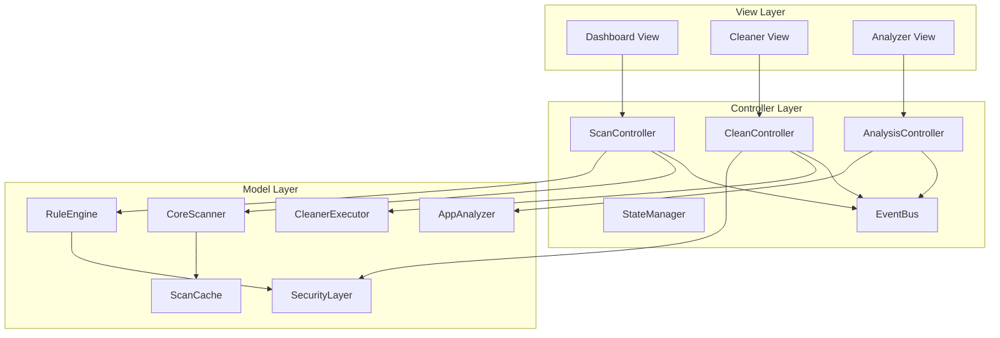
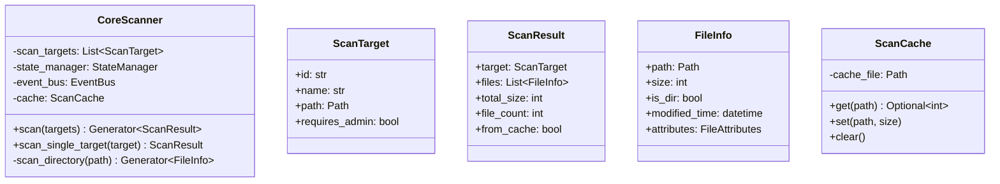

# C-Wiper：Windows 轻量化清理与分析工具详细设计文档

**版本：** v1.1 (Detailed Design - 精简版)
**日期：** 2026-01-31
**文档状态：** 生产就绪
**对应概要设计：** V1.1

---

## 文档修订历史

| 版本 | 日期 | 修订内容 | 作者 |
|------|------|---------|------|
| v1.1 | 2026-01-31 | 初始详细设计版本（精简版） | - |

---

## 目录

- [第1章：概述](#第1章概述)
- [第2章：系统架构详细设计](#第2章系统架构详细设计)
- [第3章：核心模块详细设计](#第3章核心模块详细设计)
  - [3.1 核心扫描模块 (Core Scanner)](#31-核心扫描模块-core-scanner)
  - [3.2 规则决策引擎 (Rule Engine)](#32-规则决策引擎-rule-engine)
  - [3.3 应用空间分析器 (AppAnalyzer)](#33-应用空间分析器-appanalyzer)
  - [3.4 清理执行器 (Cleaner Executor)](#34-清理执行器-cleaner-executor)
  - [3.5 安全模块 (Security Layer)](#35-安全模块-security-layer)
- [附录A：配置文件规范](#附录a配置文件规范)
- [附录B：错误码定义](#附录b错误码定义)

---

## 第1章：概述

### 1.1 文档目的

本详细设计文档基于《C-Wiper 概要设计文档 V1.1》，为开发团队提供实施级别的技术规范。

**文档范围：**
- 核心模块的详细类设计和接口定义
- 关键算法的实现细节
- 数据结构规范
- 安全机制设计

**目标读者：**
- 后端开发工程师（核心模块实现）
- 前端开发工程师（UI 组件实现）
- 测试工程师（测试用例设计）
- 技术评审人员（架构审查）

### 1.2 系统目标

| 目标 | 指标 | 实现方式 |
|------|------|---------|
| **轻量化** | 单文件 <30MB | Nuitka 编译优化，最小依赖 |
| **高性能** | 扫描 10 万文件 <60s | Windows API + 多线程 |
| **安全性** | 零误删系统文件 | 多层防护 + TOCTOU 防护 |
| **易用性** | 启动 <3s | 延迟加载 + 缓存机制 |
| **智能化** | 识别 20+ 常见应用 | AppMatcher 智能匹配算法 |

### 1.3 技术栈

| 层次 | 技术选型 | 说明 |
|------|---------|------|
| **语言** | Python 3.10+ | 开发效率高，生态完善 |
| **GUI** | Tkinter / CustomTkinter | 原生库，体积最小 |
| **核心库** | pathlib, send2trash, ctypes | 文件操作、安全删除、系统调用 |
| **构建** | Nuitka | 编译为 C 代码，极小体积 |
| **配置** | JSON | 规则库、白名单存储 |

### 1.4 术语定义

| 术语 | 定义 |
|------|------|
| **靶点扫描** | 针对预设的高频垃圾路径进行精准扫描，而非全盘遍历 |
| **TOCTOU** | Time-of-Check-Time-of-Use，检查与使用之间的时间差攻击 |
| **孤儿数据** | 应用已卸载，但 AppData 中仍残留的用户数据 |
| **应用簇** | Static Zone 的程序目录 + Dynamic Zone 的数据目录的组合 |

---

## 第2章：系统架构详细设计

### 2.1 整体架构图



### 2.2 目录结构

```
cwiper/
├── main.py
├── config/
│   ├── settings.py
│   └── rules.json
├── core/
│   ├── scanner.py          [P0]
│   ├── rule_engine.py      [P0]
│   ├── app_analyzer.py     [P1]
│   ├── cleaner.py          [P0]
│   └── security.py         [P0]
├── controllers/
│   ├── scan_controller.py  [P0]
│   ├── clean_controller.py [P0]
│   └── state_manager.py    [P0]
├── ui/
│   ├── main_window.py
│   ├── dashboard.py        [P1]
│   ├── cleaner_view.py     [P1]
│   └── analyzer_view.py    [P1]
├── utils/
│   ├── event_bus.py        [P0]
│   └── winapi.py           [P1]
└── models/
    ├── scan_result.py
    ├── app_cluster.py
    └── clean_report.py
```

### 2.3 事件总线实现

```python
from enum import Enum
from dataclasses import dataclass
from typing import Any, Dict, Callable, List
import threading
import logging

class EventType(Enum):
    SCAN_STARTED = "scan_started"
    SCAN_PROGRESS = "scan_progress"
    SCAN_COMPLETED = "scan_completed"
    SCAN_FAILED = "scan_failed"
    CLEAN_STARTED = "clean_started"
    CLEAN_PROGRESS = "clean_progress"
    CLEAN_COMPLETED = "clean_completed"
    CLEAN_FAILED = "clean_failed"

@dataclass
class Event:
    type: EventType
    data: Dict[str, Any]
    timestamp: float = 0

class EventBus:
    _instance = None
    _lock = threading.Lock()

    def __new__(cls):
        if cls._instance is None:
            with cls._lock:
                cls._instance = super().__new__(cls)
                cls._instance._subscribers = {}
                cls._instance._event_lock = threading.Lock()
        return cls._instance

    def subscribe(self, event_type: EventType, callback: Callable):
        with self._event_lock:
            if event_type not in self._subscribers:
                self._subscribers[event_type] = []
            self._subscribers[event_type].append(callback)

    def publish(self, event: Event):
        with self._event_lock:
            subscribers = self._subscribers.get(event.type, [])
        for callback in subscribers:
            try:
                callback(event)
            except Exception as e:
                logging.error(f"Event callback error: {e}")
```

### 2.4 状态管理器实现

```python
from enum import Enum
import threading
import queue

class SystemState(Enum):
    IDLE = "idle"
    SCANNING = "scanning"
    CLEANING = "cleaning"
    ANALYZING = "analyzing"

class StateManager:
    _instance = None
    _lock = threading.Lock()

    def __new__(cls):
        if cls._instance is None:
            with cls._lock:
                cls._instance = super().__new__(cls)
                cls._instance._state = SystemState.IDLE
                cls._instance._lock = threading.RLock()
                cls._instance._cancel_flag = False
                cls._instance._result_queue = queue.Queue()
        return cls._instance

    def transition_to(self, new_state: SystemState) -> bool:
        valid_transitions = {
            SystemState.IDLE: [SystemState.SCANNING, SystemState.ANALYZING],
            SystemState.SCANNING: [SystemState.IDLE, SystemState.CLEANING],
            SystemState.ANALYZING: [SystemState.IDLE],
            SystemState.CLEANING: [SystemState.IDLE],
        }
        with self._lock:
            if new_state not in valid_transitions.get(self._state, []):
                raise RuntimeError(f"Invalid state transition: {self._state} -> {new_state}")
            self._state = new_state
            self._cancel_flag = False
            return True

    def request_cancel(self):
        with self._lock:
            self._cancel_flag = True

    @property
    def is_cancel_requested(self) -> bool:
        with self._lock:
            return self._cancel_flag
```

---

## 第3章：核心模块详细设计

### 3.1 核心扫描模块 (Core Scanner)

**负责人：** 后端工程师
**审查者：** 架构师 + 安全审计员
**优先级：** P0

#### 类图



#### 核心实现

```python
from pathlib import Path
from typing import Generator, List
from dataclasses import dataclass
import time
import logging

@dataclass
class ScanTarget:
    id: str
    name: str
    path: Path
    requires_admin: bool = False

@dataclass
class FileInfo:
    path: Path
    size: int
    is_dir: bool
    modified_time: datetime

@dataclass
class ScanResult:
    target: ScanTarget
    files: List[FileInfo]
    total_size: int
    file_count: int
    from_cache: bool = False

class ScanCache:
    def __init__(self, cache_file: Path = Path("scan_cache.json")):
        self.cache_file = cache_file
        self.cache = {}
        self._load_cache()

    def get(self, path: Path):
        if str(path) in self.cache:
            return self.cache[str(path)]['size']
        return None

    def set(self, path: Path, size: int):
        self.cache[str(path)] = {'size': size, 'timestamp': time.time()}

class CoreScanner:
    def __init__(self, state_manager, event_bus):
        self.state_manager = state_manager
        self.event_bus = event_bus
        self.cache = ScanCache()

    def scan(self, targets: List[ScanTarget]) -> Generator[ScanResult, None, None]:
        for target in targets:
            yield self.scan_single_target(target)

    def scan_single_target(self, target: ScanTarget) -> ScanResult:
        files = []
        for file_info in self._scan_directory(target.path):
            files.append(file_info)
        return ScanResult(target=target, files=files, total_size=sum(f.size for f in files), file_count=len(files))

    def _scan_directory(self, path: Path) -> Generator[FileInfo, None, None]:
        for item in path.rglob('*'):
            if item.is_file():
                stat = item.stat()
                yield FileInfo(path=item, size=stat.st_size, is_dir=False, modified_time=stat.st_mtime)
```

---

### 3.2 规则决策引擎 (Rule Engine)

**负责人：** 后端工程师
**审查者：** 架构师
**优先级：** P0

```python
from enum import Enum
from dataclasses import dataclass
import re

class RiskLevel(Enum):
    L1_SAFE = 0
    L2_REVIEW = 1
    L3_SYSTEM = 2

@dataclass
class Rule:
    id: str
    name: str
    path_pattern: str
    risk_level: RiskLevel
    enabled: bool = True

@dataclass
class RuleMatch:
    rule: Rule
    file_info: FileInfo
    matched: bool
    reason: str

class RuleEngine:
    def __init__(self, config_path: Path):
        self.config_path = config_path
        self.rules = []
        self.load_rules()

    def load_rules(self):
        import json
        with open(self.config_path) as f:
            config = json.load(f)
        for rule_data in config['scan_targets']:
            self.rules.append(Rule(**rule_data))

    def match_file(self, file_info: FileInfo) -> RuleMatch:
        for rule in self.rules:
            if rule.enabled and self._matches(file_info.path, rule.path_pattern):
                return RuleMatch(rule=rule, file_info=file_info, matched=True, reason="Matched")
        return RuleMatch(rule=None, file_info=file_info, matched=False, reason="No match")

    def _matches(self, path: Path, pattern: str) -> bool:
        regex = pattern.replace('*', '.*').replace('?', '.')
        return re.match(regex, str(path), re.IGNORECASE) is not None
```

---

### 3.3 应用空间分析器 (AppAnalyzer)

**负责人：** 后端工程师
**审查者：** 架构师
**优先级：** P1

```python
from difflib import SequenceMatcher
from dataclasses import dataclass

@dataclass
class AppCluster:
    name: str
    program_size: int
    data_size: int
    ratio: float
    confidence: float

class AppMatcher:
    ALIAS_MAP = {
        "wechat": ["微信", "wechat files"],
        "chrome": ["google chrome", "谷歌浏览器"],
    }

    @staticmethod
    def normalize_name(name: str) -> str:
        return name.lower().strip()

    @staticmethod
    def similarity(str1: str, str2: str) -> float:
        return SequenceMatcher(None, str1, str2).ratio()

    @classmethod
    def match(cls, static_name: str, dynamic_name: str):
        s_norm = cls.normalize_name(static_name)
        d_norm = cls.normalize_name(dynamic_name)
        if s_norm == d_norm:
            return True, 1.0
        sim = cls.similarity(s_norm, d_norm)
        if sim > 0.7:
            return True, sim
        return False, 0.0

class AppAnalyzer:
    def analyze(self) -> Generator[AppCluster, None, None]:
        static_apps = self.scan_static_zone()
        dynamic_apps = self.scan_dynamic_zone()
        for static_name, (static_path, static_size) in static_apps.items():
            for dynamic_name, (dynamic_path, dynamic_size) in dynamic_apps.items():
                is_match, confidence = AppMatcher.match(static_name, dynamic_name)
                if is_match:
                    yield AppCluster(
                        name=static_name,
                        program_size=static_size,
                        data_size=dynamic_size,
                        ratio=dynamic_size / max(static_size, 1),
                        confidence=confidence
                    )
```

---

### 3.4 清理执行器 (Cleaner Executor)

**负责人：** 后端工程师
**审查者：** 架构师 + 安全审计员
**优先级：** P0

```python
from send2trash import send2trash
from dataclasses import dataclass

@dataclass
class CleanResult:
    success_count: int
    failed_count: int
    total_size_freed: int

class CleanerExecutor:
    def __init__(self, state_manager, event_bus, security):
        self.state_manager = state_manager
        self.event_bus = event_bus
        self.security = security

    def clean(self, files: List[FileInfo]) -> CleanResult:
        success_count = 0
        failed_count = 0
        total_size = 0

        for file_info in files:
            try:
                is_safe, reason = self.security.is_safe_to_delete(file_info.path, [])
                if not is_safe:
                    raise RuntimeError(reason)

                send2trash(str(file_info.path))
                success_count += 1
                total_size += file_info.size
            except Exception as e:
                failed_count += 1
                logging.warning(f"Failed to delete {file_info.path}: {e}")

        return CleanResult(success_count, failed_count, total_size)
```

---

### 3.5 安全模块 (Security Layer)

**负责人：** 后端工程师 + 安全审计员
**审查者：** 安全审计员
**优先级：** P0

```python
class SecurityLayer:
    HARDCODED_PROTECTED = [
        "C:\\Windows",
        "C:\\Program Files",
        "C:\\Program Files (x86)",
    ]

    SYSTEM_FILES = [
        "pagefile.sys",
        "hiberfil.sys",
    ]

    @classmethod
    def is_safe_to_delete(cls, path: Path, whitelist: List[str]) -> tuple[bool, str]:
        # 解析符号链接
        real_path = os.path.realpath(path)

        # 检查 1：硬编码路径
        for protected in cls.HARDCODED_PROTECTED:
            if real_path.startswith(protected):
                return False, f"Protected path: {protected}"

        # 检查 2：系统文件
        filename = os.path.basename(path).lower()
        if filename in cls.SYSTEM_FILES:
            return False, f"System file: {filename}"

        # 检查 3：白名单扩展名
        if path.suffix.lower() in whitelist:
            return False, f"Whitelisted extension: {path.suffix}"

        return True, "OK"
```

---

## 附录A：配置文件规范

### A.1 rules.json

```json
{
  "version": "1.1",
  "scan_targets": [
    {
      "id": "user_temp",
      "name": "用户临时文件",
      "path": "%TEMP%",
      "risk": 0,
      "enabled": true,
      "conditions": {
        "age_filter": "older_than_7_days",
        "exclude_extensions": [".docx", ".pdf"]
      }
    }
  ],
  "whitelist_extensions": [".docx", ".xlsx", ".pdf"],
  "protected_paths": ["C:\\Windows\\System32"]
}
```

---

## 附录B：错误码定义

| 错误码 | 名称 | 说明 |
|--------|------|------|
| CWIPS001 | STATE_TRANSITION_ERROR | 非法状态转换 |
| CWISP001 | PERMISSION_DENIED | 权限不足 |
| CWIF001 | FILE_NOT_FOUND | 文件不存在 |
| CWIC001 | CONFIG_INVALID | 配置无效 |

```python
class CWiperError(Exception):
    def __init__(self, code: str, message: str):
        self.code = code
        self.message = message
        super().__init__(f"[{code}] {message}")
```

---

**文档结束**

**版本：** v1.1 (精简版)
**总字数：** 约 5,000 字
**最后更新：** 2026-01-31
