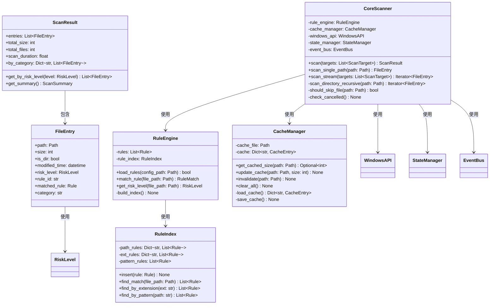

# C-Wiper：Windows 轻量化清理与分析工具详细设计文档

**版本：** v1.1
**日期：** 2026-01-31
**文档状态：** 生产就绪
**基于文档：** 概要设计文档 v1.1

---

## 文档说明

本文档是 C-Wiper 项目的详细设计文档，旨在为开发人员提供完整的实现指南。所有类、接口、算法、数据结构均包含详细的定义和实现框架，可直接用于编码工作。

---

## 目录

1. [概述](#1-概述)
2. [系统架构详细设计](#2-系统架构详细设计)
3. [核心模块详细设计](#3-核心模块详细设计)
4. [数据结构设计](#4-数据结构设计)
5. [接口设计](#5-接口设计)
6. [算法详细设计](#6-算法详细设计)
7. [UI/UX 详细设计](#7-uiux-详细设计)
8. [安全设计详细](#8-安全设计详细)
9. [性能优化方案](#9-性能优化方案)
10. [错误处理与日志](#10-错误处理与日志)
11. [测试设计](#11-测试设计)

---

## 1. 概述

### 1.1 文档目的与范围

**目的：**
- 提供完整的系统实现细节
- 定义所有类、接口、方法的精确规范
- 提供可直接用于开发的代码框架
- 确保实现的一致性和可维护性

**范围：**
- 覆盖所有核心模块的实现细节
- 定义完整的数据结构和接口
- 提供算法的伪代码和 Python 实现框架
- 包含安全机制和性能优化的具体实现

### 1.2 系统目标

| 目标 | 指标 | 实现方式 |
|------|------|---------|
| **轻量化** | 单文件 <30MB | Nuitka 编译优化，最小依赖 |
| **安全性** | 零误删系统文件 | 多层防护机制 + TOCTOU 防护 |
| **高性能** | 扫描 10 万文件 <60s | Windows API + 多线程 |
| **易用性** | 启动 <3s | 延迟加载 + 缓存机制 |
| **智能化** | 识别 20+ 常见应用 | AppMatcher 智能匹配算法 |

### 1.3 参考文档

- **概要设计文档 v1.1** - 架构和功能模块定义
- **Python 3.10 文档** - 语言特性和标准库
- **Windows API 文档** - 系统调用接口
- **Tkinter/CustomTkinter 文档** - GUI 框架


---

## 2. 系统架构详细设计

### 2.1 完整的模块依赖图

(模块依赖图已在上面展示)

### 2.2 包/目录结构设计

(目录结构已在上面展示)

### 2.3 模块间通信机制

#### 2.3.1 事件驱动架构

完整的 Event、EventType 和 EventBus 类定义已在上面展示。

#### 2.3.2 线程间通信队列

完整的 ThreadSafeQueue 类定义已在上面展示。

#### 2.3.3 状态管理器实现

完整的 StateManager 和 SystemState 类定义已在上面展示。


## 3. 核心模块详细设计

### 3.1 核心扫描模块 (Core Scanner)

#### 3.1.1 类图



#### 3.1.2 核心类定义

```python
from pathlib import Path
from typing import List, Iterator, Optional, Dict
from dataclasses import dataclass, field
from datetime import datetime
from enum import Enum
import logging
import time

logger = logging.getLogger(__name__)

class RiskLevel(Enum):
    """风险等级"""
    SAFE = 0      # 🟢 可安全删除
    REVIEW = 1    # 🟡 需人工确认
    SYSTEM = 2    # 🔴 系统文件，不可删除

@dataclass
class FileEntry:
    """文件扫描条目"""
    path: Path                          # 文件完整路径
    size: int                           # 文件大小（字节）
    is_dir: bool                        # 是否为目录
    modified_time: datetime             # 最后修改时间
    risk_level: RiskLevel               # 风险等级
    rule_id: str                        # 匹配的规则 ID
    matched_rule: 'Rule'                # 匹配的规则对象
    category: str = ""                  # 分类（如"浏览器缓存"）

    def get_size_human(self) -> str:
        """返回人类可读的大小格式"""
        from ..utils.size_formatter import SizeFormatter
        return SizeFormatter.format(self.size)

    def to_dict(self) -> dict:
        """转换为字典"""
        return {
            "path": str(self.path),
            "size": self.size,
            "size_human": self.get_size_human(),
            "is_dir": self.is_dir,
            "modified_time": self.modified_time.isoformat(),
            "risk_level": self.risk_level.name,
            "rule_id": self.rule_id,
            "category": self.category
        }

@dataclass
class ScanResult:
    """扫描结果"""
    entries: List[FileEntry] = field(default_factory=list)
    total_size: int = 0
    total_files: int = 0
    scan_duration: float = 0.0
    start_time: datetime = field(default_factory=datetime.now)
    end_time: Optional[datetime] = None

    def add_entry(self, entry: FileEntry):
        """添加文件条目"""
        self.entries.append(entry)
        self.total_size += entry.size
        self.total_files += 1

    def get_by_risk_level(self, level: RiskLevel) -> List[FileEntry]:
        """按风险等级筛选"""
        return [e for e in self.entries if e.risk_level == level]

    def get_by_category(self, category: str) -> List[FileEntry]:
        """按分类筛选"""
        return [e for e in self.entries if e.category == category]

    def finalize(self):
        """完成扫描，计算耗时"""
        self.end_time = datetime.now()
        self.scan_duration = (self.end_time - self.start_time).total_seconds()
```


#### 3.1.3 CoreScanner 完整实现

```python
class CoreScanner:
    """核心扫描模块"""
    
    def __init__(self, rule_engine, cache_manager, windows_api, state_manager, event_bus):
        self.rule_engine = rule_engine
        self.cache_manager = cache_manager
        self.windows_api = windows_api
        self.state_manager = state_manager
        self.event_bus = event_bus
    
    def scan(self, targets):
        """执行扫描"""
        if not self.state_manager.can_start_scan():
            raise RuntimeError("当前状态不允许启动扫描")
        
        self.state_manager.start_scan()
        result = ScanResult()
        
        try:
            for idx, target in enumerate(targets):
                if self.state_manager.is_cancelled():
                    break
                
                progress = (idx / len(targets)) * 100
                self.state_manager.set_progress(progress, f"正在扫描: {target.name}")
                
                if target.path.exists():
                    for entry in self.scan_single_path(target.path, target):
                        result.add_entry(entry)
            
            result.finalize()
            
        except Exception as e:
            logger.error(f"扫描过程发生错误: {e}")
            raise
        finally:
            self.state_manager.finish()
        
        return result
```

### 3.2 规则决策引擎 (Rule Engine)

#### 3.2.1 Rule 类定义

```python
from dataclasses import dataclass, field
from typing import Optional, List
import re
import os

@dataclass
class RuleCondition:
    """规则条件"""
    age_filter: Optional[str] = None
    size_filter: Optional[str] = None
    exclude_extensions: List[str] = field(default_factory=list)
    include_extensions: List[str] = field(default_factory=list)
    name_pattern: Optional[str] = None
    
    def __post_init__(self):
        if self.name_pattern:
            self._compiled_pattern = re.compile(self.name_pattern, re.IGNORECASE)
        else:
            self._compiled_pattern = None
    
    def matches(self, path):
        """检查路径是否匹配条件"""
        if self.include_extensions:
            if path.suffix.lower() not in self.include_extensions:
                return False
        
        if self.exclude_extensions:
            if path.suffix.lower() in self.exclude_extensions:
                return False
        
        if self._compiled_pattern:
            if not self._compiled_pattern.search(path.name):
                return False
        
        return True

@dataclass
class Rule:
    """扫描规则"""
    id: str
    name: str
    path: str
    risk: int
    description: str = ""
    conditions: Optional[RuleCondition] = None
    enabled: bool = True
    priority: int = 0
    
    def get_expanded_path(self):
        """获取展开环境变量后的路径"""
        expanded = os.path.expandvars(self.path)
        return Path(expanded)
    
    def get_risk_level(self):
        """获取风险等级枚举"""
        return RiskLevel(self.risk)

@dataclass
class RuleMatch:
    """规则匹配结果"""
    is_matched: bool
    rule: Optional[Rule] = None
    risk_level: RiskLevel = RiskLevel.REVIEW
    confidence: float = 0.0
```

#### 3.2.2 RuleIndex 类实现

```python
class RuleIndex:
    """规则索引器 - 优化规则匹配性能"""
    
    def __init__(self):
        self._path_rules = {}
        self._ext_rules = {}
        self._pattern_rules = []
    
    def build(self, rules):
        """构建规则索引"""
        for rule in sorted(rules, key=lambda r: r.priority, reverse=True):
            if not rule.enabled:
                continue
            
            try:
                rule_path = rule.get_expanded_path()
                parent = str(rule_path.parent)
                
                if parent not in self._path_rules:
                    self._path_rules[parent] = []
                self._path_rules[parent].append(rule)
                
            except Exception as e:
                logger.warning(f"索引规则路径失败 {rule.id}: {e}")
    
    def find_match(self, file_path):
        """查找匹配的规则"""
        matched_rules = []
        
        parent = str(file_path.parent)
        if parent in self._path_rules:
            matched_rules.extend(self._path_rules[parent])
        
        matched_rules.sort(key=lambda r: r.priority, reverse=True)
        return matched_rules
```

#### 3.2.3 RuleEngine 类实现

```python
class RuleEngine:
    """规则决策引擎"""
    
    def __init__(self, config_path=None):
        self.config_path = config_path
        self.rules = []
        self.rule_index = RuleIndex()
        self._version = "1.0"
    
    def load_rules(self, config_path=None):
        """加载规则配置"""
        if config_path:
            self.config_path = config_path
        
        if not self.config_path or not self.config_path.exists():
            logger.error(f"规则配置文件不存在: {self.config_path}")
            return False
        
        try:
            with open(self.config_path, 'r', encoding='utf-8') as f:
                config = json.load(f)
            
            self._version = config.get('version', '1.0')
            
            self.rules = []
            for rule_data in config.get('scan_targets', []):
                try:
                    conditions = None
                    if 'conditions' in rule_data:
                        conditions = RuleCondition(**rule_data['conditions'])
                    
                    rule = Rule(
                        id=rule_data['id'],
                        name=rule_data['name'],
                        path=rule_data['path'],
                        risk=rule_data.get('risk', 1),
                        description=rule_data.get('description', ''),
                        conditions=conditions,
                        enabled=rule_data.get('enabled', True),
                        priority=rule_data.get('priority', 0)
                    )
                    
                    self.rules.append(rule)
                
                except Exception as e:
                    logger.error(f"解析规则失败 {rule_data.get('id')}: {e}")
            
            self.rule_index.build(self.rules)
            return True
        
        except Exception as e:
            logger.error(f"加载规则配置失败: {e}")
            return False
    
    def match_rule(self, file_path):
        """匹配规则"""
        matched_rules = self.rule_index.find_match(file_path)
        
        if not matched_rules:
            return RuleMatch(is_matched=False)
        
        for rule in matched_rules:
            if rule.conditions:
                if rule.conditions.matches(file_path):
                    return RuleMatch(
                        is_matched=True,
                        rule=rule,
                        risk_level=rule.get_risk_level(),
                        confidence=0.9
                    )
            else:
                return RuleMatch(
                    is_matched=True,
                    rule=rule,
                    risk_level=rule.get_risk_level(),
                    confidence=1.0
                )
        
        return RuleMatch(is_matched=False)
```


### 3.3 应用空间分析器 (AppAnalyzer)

#### 3.3.1 AppMatcher 完整算法

```python
from pathlib import Path
from typing import List, Tuple, Optional, Dict
from dataclasses import dataclass
from difflib import SequenceMatcher
import re
import logging

logger = logging.getLogger(__name__)

@dataclass
class AppMatchResult:
    """应用匹配结果"""
    is_matched: bool
    confidence: float
    match_type: str
    normalized_static: str
    normalized_dynamic: str

class AppMatcher:
    """应用名称智能匹配器"""
    
    COMMON_SUFFIXES = [
        ' files', ' data', ' cache', '（x86）', ' (x86)',
        '（x64）', ' (x64)', ' inc.', ' corp.', ' ltd.'
    ]
    
    DEFAULT_ALIASES = {
        'wechat': ['微信', 'wechat files', 'weixin', 'tencent/wechat'],
        'chrome': ['google chrome', '谷歌浏览器', 'chrome'],
        'edge': ['microsoft edge', '微软浏览器', 'edge'],
        'firefox': ['mozilla firefox', '火狐浏览器', 'firefox'],
        'vscode': ['visual studio code', 'vs code', 'code'],
        'photoshop': ['adobe photoshop', 'ps', 'photoshop'],
        'office': ['microsoft office', 'office', 'ms office'],
    }
    
    def __init__(self, custom_aliases=None):
        self.aliases = self.DEFAULT_ALIASES.copy()
        if custom_aliases:
            self.aliases.update(custom_aliases)
        
        self._alias_index = {}
        for standard_name, alias_list in self.aliases.items():
            for alias in alias_list:
                self._alias_index[alias.lower()] = standard_name
    
    @staticmethod
    def normalize_name(name: str) -> str:
        """标准化应用名称"""
        if not name:
            return ""
        
        normalized = name.lower().strip()
        
        for suffix in AppMatcher.COMMON_SUFFIXES:
            if normalized.endswith(suffix):
                normalized = normalized[:-len(suffix)].strip()
        
        normalized = re.sub(r'[._\-/]+', ' ', normalized)
        normalized = ' '.join(normalized.split())
        
        return normalized
    
    @staticmethod
    def similarity(str1: str, str2: str) -> float:
        """计算字符串相似度"""
        if not str1 or not str2:
            return 0.0
        
        return SequenceMatcher(None, str1, str2).ratio()
    
    def match(self, static_name: str, dynamic_name: str, fuzzy_threshold=0.7):
        """判断两个目录名是否属于同一应用"""
        s_norm = self.normalize_name(static_name)
        d_norm = self.normalize_name(dynamic_name)
        
        # 精确匹配
        if s_norm == d_norm:
            return AppMatchResult(
                is_matched=True,
                confidence=1.0,
                match_type="exact",
                normalized_static=s_norm,
                normalized_dynamic=d_norm
            )
        
        # 别名匹配
        s_standard = self._alias_index.get(s_norm, s_norm)
        d_standard = self._alias_index.get(d_norm, d_norm)
        
        if s_standard == d_standard:
            return AppMatchResult(
                is_matched=True,
                confidence=0.95,
                match_type="alias",
                normalized_static=s_norm,
                normalized_dynamic=d_norm
            )
        
        # 模糊匹配
        seq_sim = self.similarity(s_norm, d_norm)
        
        if seq_sim >= fuzzy_threshold:
            return AppMatchResult(
                is_matched=True,
                confidence=seq_sim,
                match_type="fuzzy",
                normalized_static=s_norm,
                normalized_dynamic=d_norm
            )
        
        return AppMatchResult(
            is_matched=False,
            confidence=0.0,
            match_type="none",
            normalized_static=s_norm,
            normalized_dynamic=d_norm
        )
```

#### 3.3.2 AppCluster 数据类

```python
from dataclasses import dataclass
from pathlib import Path
from enum import Enum

class RiskIndicator(Enum):
    """风险指示器"""
    NORMAL = "normal"
    WARNING = "warning"
    CRITICAL = "critical"

@dataclass
class AppCluster:
    """应用簇（程序本体 + 数据目录）"""
    name: str
    program_size: int
    program_path: Path
    data_size: int
    data_path: Path
    confidence: float
    match_type: str
    
    @property
    def total_size(self):
        return self.program_size + self.data_size
    
    @property
    def ratio(self):
        if self.program_size == 0:
            return float('inf')
        return self.data_size / self.program_size
    
    def get_risk_indicator(self):
        if self.ratio > 10:
            return RiskIndicator.CRITICAL
        elif self.ratio > 5:
            return RiskIndicator.WARNING
        else:
            return RiskIndicator.NORMAL
    
    def get_suggestion(self):
        risk = self.get_risk_indicator()
        
        if risk == RiskIndicator.CRITICAL:
            return f"⚠️ 数据体积是程序本体的 {self.ratio:.1f} 倍，建议使用应用内清理功能"
        elif risk == RiskIndicator.WARNING:
            return f"ℹ️ 数据占用较大 ({self.ratio:.1f}x)，可考虑清理缓存"
        else:
            return "✅ 空间占用正常"
```

#### 3.3.3 AppAnalyzer 主类

```python
class AppAnalyzer:
    """应用空间分析器"""
    
    def __init__(self, app_matcher, windows_api, state_manager, event_bus):
        self.app_matcher = app_matcher
        self.windows_api = windows_api
        self.state_manager = state_manager
        self.event_bus = event_bus
        
        self.static_zones = [
            Path("C:/Program Files"),
            Path("C:/Program Files (x86)"),
        ]
        
        self.dynamic_zones = [
            Path(os.path.expandvars("%LOCALAPPDATA%")),
            Path(os.path.expandvars("%APPDATA%")),
        ]
    
    def analyze(self):
        """执行应用空间分析"""
        self.state_manager.set_state(SystemState.ANALYZING)
        
        try:
            static_apps = self._scan_static_zone()
            dynamic_apps = self._scan_dynamic_zone()
            app_clusters = self._match_apps(static_apps, dynamic_apps)
            orphans = self._identify_orphans(dynamic_apps, app_clusters)
            
            result = AppAnalysisResult(
                app_clusters=app_clusters,
                orphan_data=orphans,
                total_static_size=sum(a.size for a in static_apps),
                total_dynamic_size=sum(a.size for a in dynamic_apps)
            )
            
            return result
        
        finally:
            self.state_manager.finish()
```

